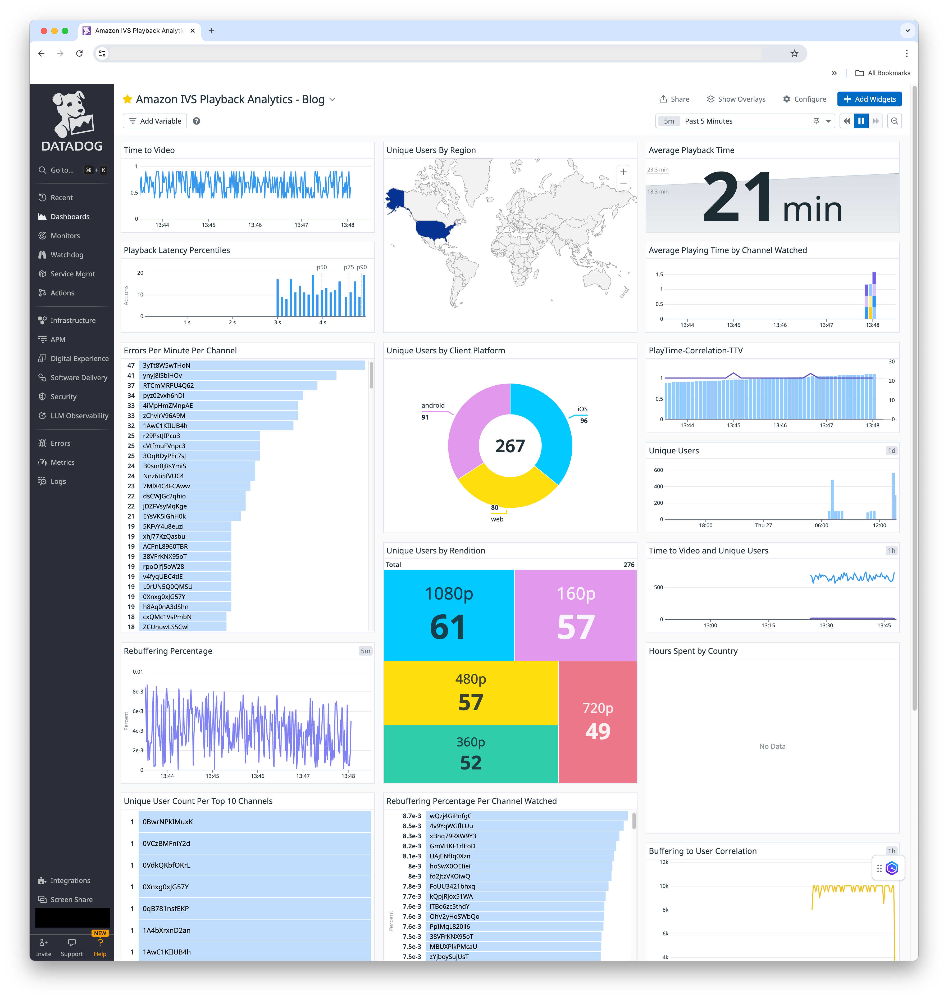

# Unlocking Playback Insights with Amazon IVS and Datadog

This repository contains a sample web application that demonstrates how to use the [Datadog Real User Monitoring (RUM) Browser SDK](https://docs.datadoghq.com/real_user_monitoring/browser/) to implement Quality of Experience (QoE) monitoring for the Amazon Player SDK for Web



## Getting started

In `index.html`, replace the following placeholders for initialize the Datadog RUM SDK with your own values. See [RUM Browser Monitoring Setup](https://docs.datadoghq.com/real_user_monitoring/browser/setup/) for info on how to get these values.

```
clientToken: "YOUR_DATADOG_RUM_APP_CLIENT_TOKEN", // Replace with your Datadog RUM app client token
applicationId: "YOUR_DATADOG_RUM_APP_ID",         // Replace with your Datadog RUM app app ID
service: "REPLACE WITH YOUR OWN SERVICE NAME",    // Replace with your own service name (e.g.)
env: "REPLACE WITH YOUR ENV",                     // Replace with your own environment name (e.g. dev)
```

Open `index.html` in a browser. Select a channel to play from the dropdown and click play. Each channel is a continually playing test stream sourced from [here](https://docs.datadoghq.com/real_user_monitoring/browser/).

## Creating the dashboard

After running the code, to create your dashboard, import this [JSON file](https://github.com/aws-samples/unlocking-playback-insights-with-amazon-ivs-and-datadog/blob/main/datadog-amazon-ivs-playback-analytics-dashboard.json). It is an exported copy of a dashboard that will graph the following metrics.

- Time to Video
- Average Playback Latency
- Unique Viewers by Rendition
- Buffer Empties per Minute Watched
- Average Buffer Time
- Errors Per Channel
- Average Buffer Time
- Buffer Empties Per Minute Watched (BEMW)
- Average Viewing Time
- Unique Views
- Unique Viewer Count Per Top 10 Channels
- Unique Viewers by Client Platform
- Percent Time Buffering by Channel Watched
- Unique Views by Region

Follow this [get started guide](https://docs.datadoghq.com/dashboards/#get-started) from Datadog to create a new dashboard. Once you have created a new dashboard, you will be taken to a blank canvas to add dashboard widgets. Click “Configure” in the upper right hand corner select “Import Dashboard JSON”. From there, upload this [JSON file](https://github.com/aws-samples/unlocking-playback-insights-with-amazon-ivs-and-datadog/blob/main/datadog-amazon-ivs-playback-analytics-dashboard.json).


# Key Functionality

- **Initialization**: The initializeQoS function in `js/qos_sdk.js` is called to set up the QoS monitoring. It attaches event listeners to the IVS player for various [player states](https://aws.github.io/amazon-ivs-player-docs/1.28.0/web/enums/PlayerState.html) (`READY`, `BUFFERING`, `PLAYING`, `IDLE`, `ENDED`) and [player events](https://aws.github.io/amazon-ivs-player-docs/1.28.0/web/enums/PlayerEventType.html) (`ERROR`, `INITIALIZED`, `QUALITY_CHANGED`).

- **Player State Tracking**: Several variables are maintained to track the player's state, such as
  `hasBeenPlayingVideo`, `lastPlayerStateREADYTime`, `lastPlayerStateINITIALIZEDTime`,`lastPlayerState`, and
  `lastPlayerStateUpdateOrPlaybackSummaryEventSentTime`. These variables are used to compute various QoS metrics, such as startup latency, time to video, playing time, and buffering time.

- **User and Session Identification**: A unique `userId` and `sessionId` are set for each playback session, which are used to identify the user and session in the QoS events.

- **QoS Event Handling**: Contains logic to listen for various player state changes and updates the QoS event variables accordingly. For example, when the player transitions from `PLAYING` to `BUFFERING`, the `playingTimeMsInLastMinute` and `bufferingCountInLastMinute` variables are updated accordingly.

- **Quality Change Handling**: Contains logic to listen for the `QUALITY_CHANGED` event and sends a "quality changed" event when the player switches to a different video quality.

- **Playback Start and End Events**: The code sends a "playback start" event when the player starts playing a video, and a "playback end" event when the player stops playing (either due to `ENDED` or `IDLE` state).

- **Datadog Integration**: The Datadog RUM (Real User Monitoring) SDK is used to send the QoS events to Datadog

## Events sent to Datadog

Once you start playing a stream, `js/qos_sdk.js` sends the following JSON payload using the Datadog RUM SDK as a [RUM custom action](https://docs.datadoghq.com/real_user_monitoring/guide/send-rum-custom-actions/?tab=npm). Custom actions in Datadog allow you to send custom data/metrics to Datadog. These payload events will appear in the Actions tab of the [Datadog RUM Explorer](https://docs.datadoghq.com/real_user_monitoring/explorer/)

You can then [create facets and measures](https://docs.datadoghq.com/real_user_monitoring/guide/send-rum-custom-actions/?tab=npm#create-facets-and-measures-on-attributes) off of these attributes sent in your JSON payload to [build dashboard widgets](https://docs.datadoghq.com/real_user_monitoring/guide/send-rum-custom-actions/?tab=npm#use-attributes-in-the-rum-explorer). Facets and measures are ways to register a given attribute with Datadog so that it can be used to query against and create a dashboard widget.

`PLAYBACK_SUMMARY`

```
{
  "buffering_count": integer,  // Number of buffering events in the last minute (e.g. 5)
  "buffering_time_ms": integer,  // Total time spent buffering in the last minute (e.g. 1000)
  "channel_watched": string,  // Name of the channel being watched (e.g. "ABC News")
  "client_platform": string,  // Platform used to play the content (e.g. "Web", "iOS", "Android")
  "error_count": integer,  // Number of errors encountered during playback (e.g. 2)
  "metric_type": string,  // Type of metric being measured (e.g.  PLAYBACK_SUMMARY)
  "live_latency_ms": integer,  // The latency from the server to the player in milliseconds (e.g. 5000)
  "playing_time_ms": integer,  // Total time spent playing content in milliseconds (e.g. 3600000)
  "rendition_height": integer,  // Height of the video rendition (e.g. 1080)
  "rendition_name": string,  // Name of the video rendition (e.g. "1080p", "720p", "360p", etc.)
  "session_id": string,  // Unique identifier for the playback session (e.g. "xxxx-xxxx-xxxx")
  "startup_latency_ms": integer,  // Time taken for the player to start playing the first frame in milliseconds (e.g. 2000)
  "user_id": string  // Unique UUID of each device if localStorage is supported
}
```
